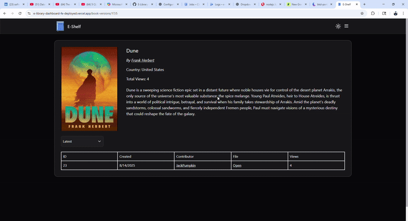

### 📖 E-Library App with AI Reading Assistant
An AI-powered e-library where readers can search, share, and enjoy e-books with built-in translation, summarization, and content analysis. Supports multiple book versions and in-app PDF reading for a seamless reading experience.

### 🛠 Technologies Used
React, TailwindCSS, ShadCn, Redux, RTK Query, Node.js, Prisma, JWT, PostgreSQL, Redis, Docker, CI/CD, Google Cloud, AWS S3, and Google Gemini API.

### 🌐 Demo
Demo video using the app: [Demo](https://www.youtube.com/watch?v=_gGqr-Li2Js)

**Note:** The server deployed on Google Cloud run uses cold starts, so initial load may take a moment

### 📦 Current Features

| Feature | Description |
|---------|-------------|
| 📚 **Search & Share** | Upload books with multiple versions (illustrated, plain text, etc.) |
| 👁 **View Tracking** | Tracks views per version and total per book, with anti-spam measures via IP/user ID blacklisting in Redis with set time frame |
| 🤖 **Reading AI Assistant** | Translate, summarize, and analyze selected text in real-time with Google's Gemini |
| 🤖 **Books Discovery AI Assistant** | A tailored chat bot powered by Google Gemini, integrating with the weekly updated New York Times best seller books API. Enabling real-time awareness of trending and popular books through dynamic context injection|
| 📄 **In-App PDF Reading** | Read e-books (PDF files) directly in the browser without leaving the app |

### 🚀 Future Features

| Feature | Description |
|---------|-------------|
| 📚 **Reading Progress Tracking** | Track users’ reading progress (page numbers) and allow statuses such as "reading," "saved," or "completed" |
| 💡 **Books Recommendations** | Use progress data and AI agents to recommend books available on the app |
| 📖 **Users As Authors** | Allow users to publish their own books by implementing a stricter Role-Based Access Control (RBAC) |

